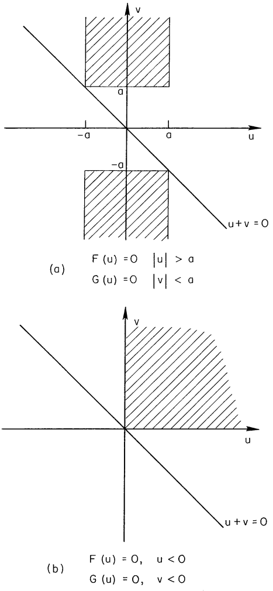

## A PRODUCT THEOREM FOR HILBERT TRANSFORMS

### E. Bedrosian

In engineering analysis, the need for the Hilbert transform of a product of functions occasionally arises. Also, forming products is a useful method for extending tables of Hilbert transforms. The following theorem provides a simple method for handling such products under certain conditions.

Theorem: Let $f(x)$ and $g(x)$ denote generally complex functions in $L^{2}(-\infty, \infty)$ of the real variable $x$. If
a) the Fourier transform, $F(u)$, of $f(x)$ vanishes for $|u|>a$ and the Fourier transform, $G(u)$, of $g(x)$ vanishes for $|u|<a$, where $a$ is an arbitrary positive constant, or
b) $f(x)$ and $g(x)$ are analytic (i.e., their real and imaginary parts are Hilbert pairs),
then the Hilbert transform of the product of $f(x)$ and $g(x)$ is given by

$$
\begin{equation*}
H[f(x) g(x)]=f(x) H[g(x)] \tag{1}
\end{equation*}
$$

Proof: In terms of their Fourier transforms, the product $f(x) g(x)$ can be written

$$
\begin{equation*}
f(x) g(x)=\frac{1}{(2 \pi)^{2}} \int_{-\infty}^{\infty} d u \int_{-\infty}^{\infty} d v F(u) G(v) e^{i(u+v) x} \tag{2}
\end{equation*}
$$

Now (from Ref. 1; 15.1 (5) and 15.2 (38))

$$
\begin{equation*}
H\left[e^{i b x}\right]=i \operatorname{sgn}(b) e^{i b x} \tag{3}
\end{equation*}
$$

so

$$
\begin{equation*}
H[f(x) g(x)]=\frac{1}{(2 \pi)^{2}} \int_{-\infty}^{\infty} d u \int_{-\infty}^{\infty} d v F(u) G(v) i \operatorname{sgn}(u+v) e^{i(u+v) x} \tag{4}
\end{equation*}
$$

The shaded regions in Fig. I are those in which the product $F(u) G(v)$ is non-vanishing for the conditions of the theorem. In Fig. la the non-overlapping Fourier transforms yield two semi-infinite strips in which the product is non-vanishing; in Fig. 1b, for the analytic functions the Fourier transforms vanish for negative arguments ${ }^{(2)}$ so that the product is non-vanishing only in the first quadrant. In both cases

$$
\begin{equation*}
\operatorname{sgn}(u+v)=\operatorname{sgn} v \tag{5}
\end{equation*}
$$

over the regions of integration in which the integrand is non-vanishing. Thus, Eq. (4) can be written

$$
\begin{align*}
H[f(x) g(x)] & =\frac{1}{(2 \pi)^{2}} \int_{-\infty}^{\infty} d u \int_{-\infty}^{\infty} d v F(u) G(v) i \operatorname{sgn} v e^{i(u+v) x} \\
& =f(x) \frac{1}{2 \pi} \int_{-\infty}^{\infty} d v G(v) i \operatorname{sgn} v e^{i v x} \tag{6}
\end{align*}
$$

But

$$
\begin{align*}
H[g(x)] & =\frac{1}{2 \pi} \int_{-\infty}^{\infty} d v G(v) H\left[e^{i v x}\right] \\
& =\frac{1}{2 \pi} \int_{-\infty}^{\infty} d v G(v) i \operatorname{sgn} v e^{i v x} \tag{7}
\end{align*}
$$

so Eq. (6) finally becomes

$$
\begin{equation*}
H[f(x) g(x)]=f(x) H[g(x)], \quad \text { Q.E.D. } \tag{8}
\end{equation*}
$$

*Fig. 1 — Regions of Intergration*

In circuit or communication theory terms, part (a) of the theorem states that the Hilbert transform of the product of a low-pass and a high-pass signal with non-overlapping spectra is given by the product of the low-pass signal and the Hilbert transform of the high-pass signal.

Examples of product transforms derivable from the foregoing are given by Erdélyi. ${ }^{(1)}$ For instance, his entry 15.3 (18) gives the Hilbert transform

$$
H\left[\sin a x J_{n}(b x)\right]=\cos a x J_{n}(b x), \quad 0<b<a, n=0,1,2, \ldots
$$

The Fourier transform of the Bessel function vanishes for values of the transform variable above $b$, so that it constitutes the low-pass function. Consequently, the Hilbert transform of the product is given by the product of the Bessel function and the Hilbert transform of the circular function.

Other suitable functions which can be used to build up further entries can be found in Erdélyi ${ }^{(3)}$ and Campbell and Foster. ${ }^{(4)}$ For example, the Fourier transform of $\mathrm{Ci}(\mathrm{ax})=-\int_{\mathrm{ax}}^{\infty} \frac{\cos \mathrm{t}}{\mathrm{t}} \mathrm{dt}$ vanishes for values of the transform variable below $a^{*}$ so it can serve as a highpass function. Since its Hilbert transform is given by ${ }^{* *}$

$$
H[\operatorname{Ci}(a x)]=-\operatorname{sgn} x \operatorname{si}(a|x|)
$$

it follows that the Hilbert transform of $\sin \mathrm{bx} \mathrm{Ci}(\mathrm{ax})$ is given by $H[\sin b x C i(a x)]=-\operatorname{sgn} x \sin b x \operatorname{si}(a|x|), \quad 0<b<a$,
*Ref. 3; 1.11 (13)
${ }^{* *}$ Ref. 1; 15.3 (3)
where

$$
\operatorname{si}(x)=-\int_{x}^{\infty} \frac{\sin t}{t} d t
$$

A product of interest in communication theory is the form $r(t) \cos \left(\omega_{0} t+\varphi\right)$ which represents a general double-sideband, amplitude-modulated signal. As indicated by Urkowitz, ${ }^{(5)}$ and as can be seen readily from the product theorem, its Hilbert transform is given by $r(t) \sin \left(\omega_{0} t+\varphi\right), \omega_{0}>0$, provided that the highest frequency component in $r(t)$ is less than $\omega_{0}$. It is interesting to contrast this apparently simple form, which requires a spectral restriction, with the more general form $r(t) \cos \left[\omega_{0} t+\varphi(t)\right]$ whose Hilbert transform is given by $r(t) \sin \left[\omega_{0} t+\varphi(t)\right]$ with no such restriction. ${ }^{\text {兰 }}$
*Kelly, Reed and Root ${ }^{(6)}$ show that the representation $r(t) \cos \left[\omega_{0} t+\varphi(t)\right]$ is actually the real part of a complex signal $r(t) e^{i\left[\omega_{0} t+\varphi(t)\right]}$ which is analytic so that its real and imaginary parts form a Hilbert pair. Note that $r(t)$ and $\varphi(t)$ are uniquely specified for a given real wave form. It should be mentioned in this connection that the result given by Lerner(7) indicating an error term related to the signal bandwidth is incorrect.

